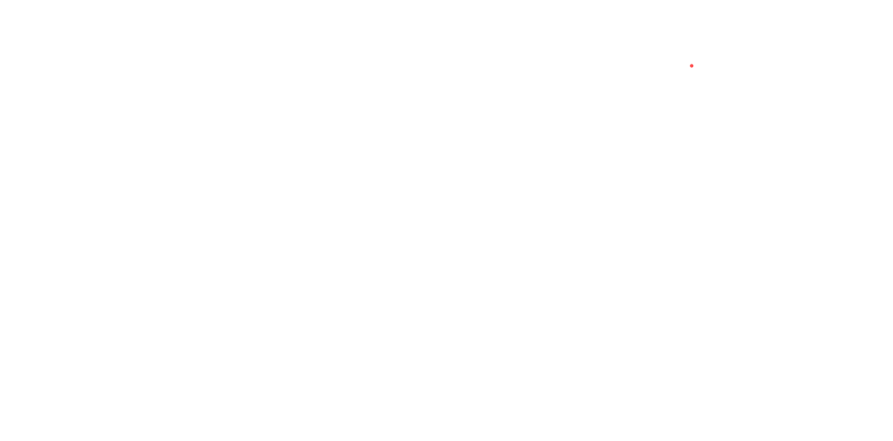

<div align="center">
<h1>tiny-rag</h1>
<p><strong>RAG without the magic.</strong><br>No LangChain. No vector DB. Just Python you can actually read.</p>


</div>

---

```bash
python rag50_ollama.py --file sample.txt --query "What is the return policy?"
```

Output:
```
Loading and chunking document
Embedding 12 chunks
Retrieving relevant context
Generating answer

Q: What is the return policy?
A: You can return any unused item within 30 days of purchase for a full refund. Items must be in original packaging with all tags attached. Digital products and perishables are non-refundable.
```

## Why this exists

Most RAG tutorials bury the concept under hundreds of lines of framework glue. This repo shows every step raw in about 50 lines per file. How chunking works, what embeddings really are (just arrays of floats), why cosine similarity is only 3 lines of numpy, and how context stuffing grounds LLM answers. Read it top to bottom in 5 minutes and you will understand RAG completely.

## Architecture



> 5 functions. 1 file. 3 providers. Same pipeline every time.

## Choose your provider

| Feature | Ollama | HuggingFace | Cohere |
| :--- | :--- | :--- | :--- |
| **Cost** | 100% Free | Free Tier | Free Tier |
| **API Key** | Not needed | Required | Required |
| **Runs Locally** | Fully local | Embeddings only | Cloud only |
| **Internet** | Not needed | For generation | Yes |
| **Setup** | Medium | Medium | Easiest |
| **Best for** | Privacy and offline | Local embedding control | Quick prototyping |

Not sure which to pick? No API key and want full privacy use Ollama. Want local embeddings and okay with a free key use HuggingFace. Just want it running in under 2 minutes use Cohere.

## Live Examples

### Direct fact retrieval

```bash
python rag50_ollama.py --file sample.txt --query "What is the return policy?"
```

```
A: You can return any unused item within 30 days for a full refund.
```

### Multi-fact reasoning

```bash
python rag50_ollama.py --file sample.txt --query "How do I reach Gold status and what do I get?"
```

```
A: Gold status requires 500 loyalty points. Benefits include free expedited shipping on all orders.
```

### ⭐ Hallucination guard

```bash
python rag50_ollama.py --file sample.txt --query "Do you offer student discounts?"
```

```
A: I don't know.
```

The model refuses to guess when the answer is not in the document. This is what makes RAG safer than vanilla LLM prompting.

## Quick Start

### Ollama

```bash
ollama pull nomic-embed-text && ollama pull llama3.2
ollama serve
pip install ollama numpy
python rag50_ollama.py --file sample.txt --query "What is the return policy?"
```

### HuggingFace

```bash
pip install sentence-transformers huggingface-hub numpy
export HF_TOKEN="hf_your_token"
python rag50_huggingface.py --file sample.txt --query "What is the return policy?"
```

### Cohere

```bash
pip install cohere numpy
export COHERE_API_KEY="your_key"
python rag50_cohere.py --file sample.txt --query "What is the return policy?"
```

## Ollama Setup Full Guide

### macOS

```bash
brew install ollama
```

Or download from https://ollama.com/download

### Linux

```bash
curl -fsSL https://ollama.com/install.sh | sh
```

### Windows

Download OllamaSetup.exe from https://ollama.com/download and run it.

### Pull models and verify

```bash
ollama pull nomic-embed-text
ollama pull llama3.2
ollama list
ollama serve
```

> macOS desktop app users do not need to run `ollama serve` manually.

## HuggingFace Token Full Guide

1. Create a free account at https://huggingface.co/join
2. Go to https://huggingface.co/settings/tokens
3. Click **New token**, any name, Role **Read**, click **Generate**
4. Copy the token — it starts with `hf_`

```bash
# Mac/Linux
export HF_TOKEN="hf_your_token_here"

# Mac/Linux — permanent
echo 'export HF_TOKEN="hf_your_token_here"' >> ~/.zshrc && source ~/.zshrc

# Windows (Command Prompt)
set HF_TOKEN=hf_your_token_here

# Windows (PowerShell)
$env:HF_TOKEN="hf_your_token_here"
```

## Cohere API Key Full Guide

1. Create a free account at https://dashboard.cohere.com
2. Go to https://dashboard.cohere.com/api-keys
3. Click **New Trial Key** and copy it immediately

```bash
# Mac/Linux
export COHERE_API_KEY="your_key_here"

# Mac/Linux — permanent
echo 'export COHERE_API_KEY="your_key_here"' >> ~/.zshrc && source ~/.zshrc

# Windows (Command Prompt)
set COHERE_API_KEY=your_key_here

# Windows (PowerShell)
$env:COHERE_API_KEY="your_key_here"
```

> Free tier gives 1000 API calls per month which is more than enough for learning.

## Use your own document

```bash
python rag50_ollama.py --file my_document.txt --query "Your question here"
python rag50_ollama.py --file my_document.txt --query "Your question" --top-k 5
```

Works with any plain text file. Meeting notes, documentation, articles, books.

## Project Structure

```text
tiny-rag/
├── rag50_ollama.py        local inference, zero cost, fully private
├── rag50_huggingface.py   free cloud generation, local embeddings
├── rag50_cohere.py        free tier API, fastest setup
├── sample.txt             demo document, Acme Store policy
├── requirements_ollama.txt
├── requirements_huggingface.txt
├── requirements_cohere.txt
├── .gitignore
└── LICENSE
```

## Contributing

Adding a new provider? Follow these rules and open a PR. One file only, no shared modules. Under 75 lines, comments included. Same 5-step structure: load, embed, similarity, retrieve, generate. Same CLI interface with `--file`, `--query`, `--top-k` flags. Good candidates: Gemini, Groq, Mistral, AWS Bedrock, Azure OpenAI.

## License

MIT. Use it, fork it, ship it.

---

<div align="center">
<sub>If this helped you understand RAG, consider starring the repo</sub>
</div>
